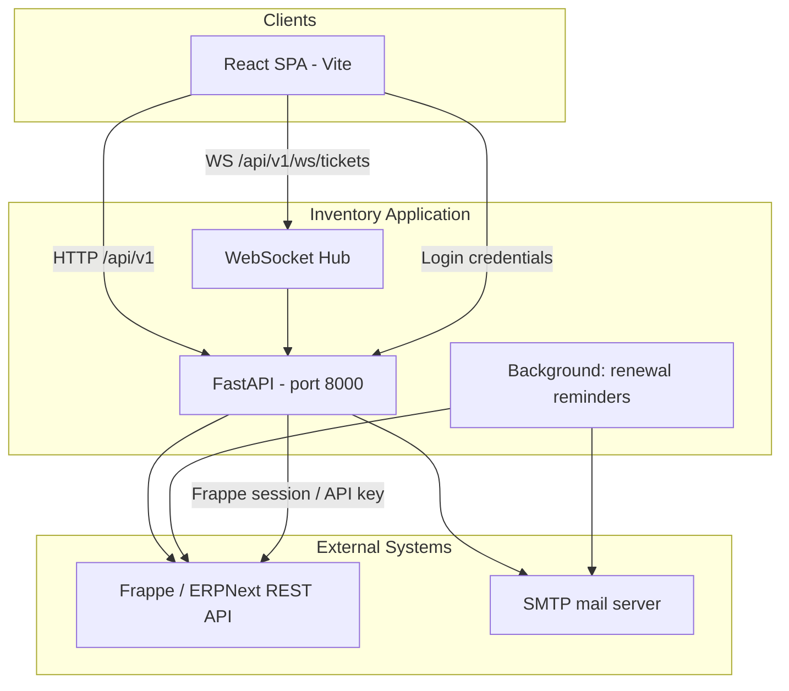
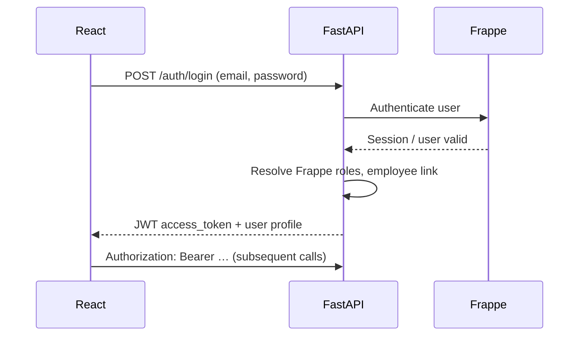
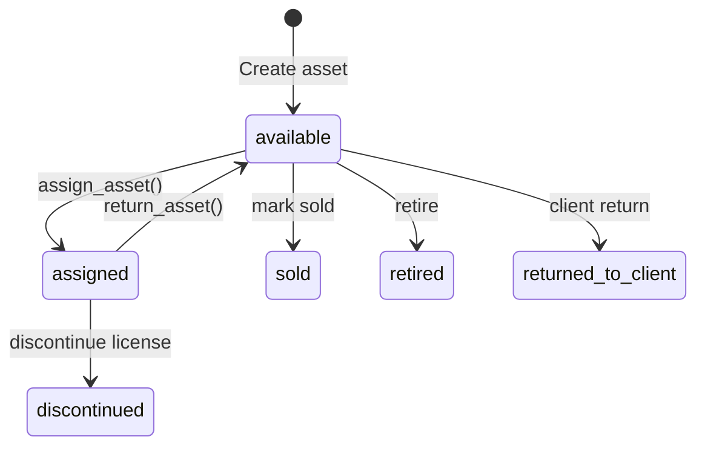
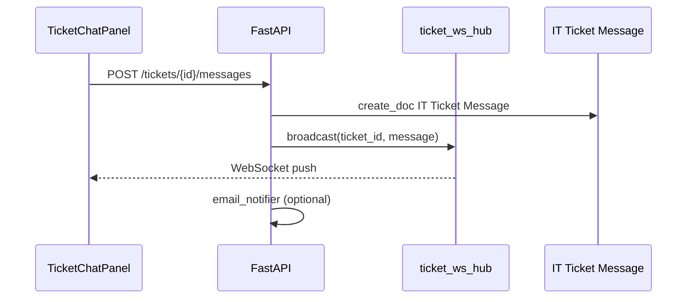

# IT Fixed Assets Inventory — Design Document

TalentServ's inventory management portal for tracking hardware, software licenses, training courses, and IT support tickets. The system is a **thin application layer** over **Frappe / ERPNext (HRMS)** — there is no standalone inventory database.

---

## 1. Purpose and scope

| In scope | Out of scope |
|----------|--------------|
| Fixed asset register (laptops, monitors, accessories) | Full ERPNext accounting workflows |
| Software licenses and renewals | HRMS payroll / leave |
| Training course seats and subscriptions | HRMS chatbot (isolated from ticket chat) |
| Asset assign / return / lifecycle | Direct Item master management in UI |
| IT tickets (device requests, repair, support) | |
| Dashboard KPIs, reports, bulk CSV import | |
| Email notifications (renewals, tickets, approvals) | |
| Real-time ticket conversation (WebSocket) | |

**Production URLs (reference):**

| Environment | Frontend | Backend API | Frappe site |
|-------------|----------|-------------|-------------|
| Dev | http://localhost:5173 | http://127.0.0.1:8000 | hrms.talentserv.co.in |
| Prod (typical) | inventory.talentserv.co.in | (API host) | hrms.talentserv.co.in |

---

## 2. Architecture overview



### Design principles

1. **Frappe is the system of record** — assets, employees, tickets, and assignment logs live in ERPNext DocTypes.
2. **Stateless API** — JWT carries user identity and roles; no app-side user table (except token claims).
3. **Mapper layer** — `frappe_mappers.py` translates Frappe field names ↔ app schemas; `frappe_store.py` implements business operations.
4. **Graceful degradation** — optional Frappe custom fields are detected at runtime; features disable cleanly if DocTypes/fields are missing.
5. **Role-based UI** — employees see “My devices”; IT admins see full inventory, dashboard, and reports.

---

## 3. Technology stack

| Layer | Technology |
|-------|------------|
| Frontend | React 18, Vite, React Router, Recharts |
| Backend | Python 3.11+, FastAPI, Uvicorn, Pydantic v2 |
| Auth | JWT (python-jose), OAuth2 password flow |
| HTTP client | httpx → Frappe REST |
| Real-time | FastAPI WebSocket + in-process hub |
| Email | SMTP (stdlib / custom notifier) |
| Data store | Frappe / ERPNext only |
| Export | openpyxl (reports), CSV bulk import |

---

## 4. Repository structure

```
Inventry-Management/
├── backend/
│   ├── app/
│   │   ├── main.py              # FastAPI app, CORS, lifespan (renewal loop)
│   │   ├── config.py            # pydantic-settings from .env
│   │   ├── security.py          # JWT create/validate
│   │   ├── auth_user.py         # AuthUser model
│   │   ├── enums.py             # AssetStatus, TicketStatus, TicketRequestMode, …
│   │   ├── schemas/             # Pydantic request/response models
│   │   ├── api/                 # Route handlers (thin)
│   │   └── services/
│   │       ├── frappe_client.py     # Low-level Frappe HTTP
│   │       ├── frappe_store.py      # Domain operations (~4k lines)
│   │       ├── frappe_mappers.py    # DocType ↔ schema mapping
│   │       ├── frappe_auth.py       # Login against Frappe
│   │       ├── asset_category_kinds.py
│   │       ├── asset_tag_suggestion.py
│   │       ├── ticket_approval.py
│   │       ├── ticket_message_permissions.py
│   │       ├── ticket_ws_hub.py
│   │       ├── app_permissions.py
│   │       ├── email_notifier.py
│   │       ├── renewal_reminders.py
│   │       └── hardware_retirement.py
│   ├── FRAPPE_SETUP.md          # One-time Frappe configuration
│   ├── requirements.txt
│   └── .env.example
├── frontend/
│   ├── src/
│   │   ├── App.jsx              # Routes + nav shell
│   │   ├── auth/                # AuthContext, AppDataContext
│   │   ├── api/client.js        # Axios + JWT interceptor
│   │   ├── pages/               # Feature pages
│   │   ├── components/          # KpiCard, TicketChatPanel, …
│   │   ├── hooks/               # useTicketChat
│   │   └── utils/               # assetHelpers, format, filters
│   └── vite.config.js           # Proxy /api and WebSocket to :8000
├── scripts/dev.ps1              # Start backend + frontend
└── project run commands.txt
```

---

## 5. Data model (Frappe DocTypes)

### Core entities

| App concept | Frappe DocType | Primary identifier |
|-------------|------------------|-------------------|
| Asset | `Asset` | Document name (e.g. `AST-00042`) |
| Inventory ID | `asset_name` | Human tag (e.g. `TS-LAP-001`) |
| Category | `Asset Category` | Category name |
| Employee | `Employee` | Employee ID |
| Client | `Customer` | Customer name |
| Vendor | `Supplier` | Supplier name |
| IT Ticket | `IT Ticket` | `IT-TKT-2026-00001` |
| Ticket message | `IT Ticket Message` | Separate DocType |
| Assignment log | `IT Asset Assignment Log` | Per assign/return event |

### Asset ownership

| `ownership_type` | Frappe fields | Meaning |
|------------------|---------------|---------|
| `own` | `supplier` set | TalentServ-owned |
| `client` | `customer` set | Client-owned on loan |

### Asset status mapping

| App status | Frappe signal |
|------------|---------------|
| `available` | No `custodian` |
| `assigned` | `custodian` = Employee |
| `sold` | `status` = Sold + sold custom fields |
| `retired` | `status` = Scrapped |
| `discontinued` | `status` = Cancelled |
| `returned_to_client` | Client return custom fields |

### Asset category taxonomy

Categories are classified in `asset_category_kinds.py`:

| Kind | Examples | ID prefix | Renewal |
|------|----------|-----------|---------|
| Hardware | Laptop, Monitor | `TS-LAP-`, `TS-MAC-` | No |
| Software license | Software License | `TS-SOFT-` | Yes |
| Training course | Training Course | `TS-TRN-` | No |
| Course subscription | Course Subscription | `TS-CORS-` | Yes |

Default training categories are auto-created when an IT admin loads the category list.

### Ticket model

| Field | Purpose |
|-------|---------|
| `subject`, `description` | Request details |
| `asset_category` | Device type context |
| `asset` | Linked asset (optional) |
| `requested_asset` | Free-text new device request |
| `request_mode` | **Repair** vs **New Device** (IT admin) |
| `approval_status` | Manager approval for asset requests |
| `resolution_action`, `resolution_comment` | Required on resolve/close |

---

## 6. Authentication and authorization

### Login flow



### Roles (from Frappe User roles + config)

| Flag | Typical Frappe roles | Capabilities |
|------|---------------------|--------------|
| `is_app_admin` | IT Admin, HR Manager, System Manager | Full inventory, dashboard, reports, ticket admin |
| `is_ticket_admin` | Same as above (legacy alias) | Ticket assign, fulfill, resolve |
| `is_hr_manager` | HR Manager | Approve/reject asset requests |
| `is_line_manager` | User with direct reports | Team page, approval on reports' tickets |
| Employee (default) | Employee | Own devices, own tickets, create tickets |

Admin allowlists: `FRAPPE_APP_ADMIN_EMAILS`, `FRAPPE_TICKET_ADMIN_EMAILS` in `.env`.

### Permission enforcement

- **Route level:** FastAPI `Depends(get_current_user)`, `require_app_admin`, ticket-specific checks in `app_permissions.py` and `ticket_permissions.py`.
- **Data level:** Employees filtered to own assets/tickets; assignees can view assigned tickets; Frappe API user permissions gate writes.

---

## 7. Backend design

### Layer responsibilities

| Layer | Files | Responsibility |
|-------|-------|----------------|
| API | `app/api/*.py` | HTTP validation, auth deps, status codes |
| Schemas | `app/schemas/` | Pydantic models for I/O |
| Store | `frappe_store.py` | Business logic, orchestration, caching |
| Mappers | `frappe_mappers.py` | Field constants, DocType payloads, sorting |
| Client | `frappe_client.py` | GET/POST/PATCH/DELETE to Frappe |
| Domain helpers | `ticket_approval.py`, `asset_category_kinds.py`, … | Pure classification rules |

### Key services

| Service | Role |
|---------|------|
| `FrappeStore` | Single entry point for all inventory operations |
| `ticket_approval.py` | Asset request detection, fulfill eligibility, repair vs new device |
| `asset_tag_suggestion.py` | Next inventory ID (`TS-LAP-004`) |
| `email_notifier.py` | Ticket events, renewal alerts, approval emails |
| `renewal_reminders.py` | Background loop on app startup |
| `ticket_ws_hub.py` | Broadcast new messages to connected clients |
| `hardware_retirement.py` | Flag aged laptops/MacBooks for review |

### Caching

TTL caches (~5 min) for categories, clients, vendors, and Frappe role lookups reduce repeated list API calls during asset enrichment.

---

## 8. Frontend design

### Routing and access

| Path | Page | Access |
|------|------|--------|
| `/login` | Login | Public |
| `/` | Dashboard | IT admin |
| `/assets` | Asset list | All (filtered for employees) |
| `/assets/:id` | Asset detail | All (scoped) |
| `/tickets` | Ticket list | All |
| `/tickets/:id` | Ticket detail + chat | Viewers per ticket rules |
| `/team` | Manager team view | Line managers |
| `/employees` | Employee picker source | IT admin |
| `/reports` | Charts + export | IT admin |
| `/business-partner` | Vendors + clients | IT admin |

### State management

| Context | Purpose |
|---------|---------|
| `AuthContext` | JWT, user profile, login/logout |
| `AppDataContext` | Cached assets, employees, categories, clients, vendors; bootstrap refresh |

### Notable UI patterns

- **Filter persistence** — `assetsFilterPersistence.js` stores list filters in URL + sessionStorage; dashboard KPI cards deep-link with filters.
- **Category-aware forms** — `assetHelpers.js` switches labels (serial vs license key vs enrollment ID).
- **Ticket chat** — `useTicketChat.js` + WebSocket with REST fallback; `TicketChatPanel.jsx`.
- **Ticket handling mode** — IT admin selects Repair vs New device allocation on ticket detail.

### Dev proxy

Vite proxies `/api` and WebSocket to `http://127.0.0.1:8000` so the SPA uses relative URLs in development.

---

## 9. Key business flows

### 9.1 Asset lifecycle



**Assign:** Sets Frappe `custodian`, creates `IT Asset Assignment Log`, optional Asset Movement.  
**Return:** Closes open assignment logs, clears `custodian`, syncs custodian with log state (handles stale Frappe data).

### 9.2 Inventory ID suggestion

Prefix pattern: `{OWNER}-{CATEGORY}-{SEQ}`

- Owner: `TS` (TalentServ) or client code (e.g. `PC` for Procore)
- Category: `LAP`, `SOFT`, `TRN`, `CORS`, …
- Sequence: auto-increment from existing tags in scope

### 9.3 IT ticket flows

#### Employee creates ticket

| Ticket kind | Path | Result |
|-------------|------|--------|
| General IT support | No device category | Support ticket, no fulfillment |
| Device support | Related to device + pick assigned asset | Linked asset, repair mode |
| New device request | Other — not in list + `requested_asset` | Approval → fulfill from stock |

#### IT admin: repair vs new device

| `request_mode` | Fulfill panel | Resolve without new asset |
|----------------|---------------|---------------------------|
| `repair` | Hidden | Yes (Issue fixed, Software installed, …) |
| `new_device` | Shown when approved | No — must link/assign asset |
| Unset | Hidden until IT classifies | Yes (for misclassified tickets) |

#### Fulfillment

`POST /tickets/{id}/fulfill` → validates stock → `assign_asset()` to requester → links ticket `asset` field → notifies requester.

#### Approval (asset requests)

Manager/HR approves MacBook or category-based device requests before IT fulfills. Configurable via `FRAPPE_MACBOOK_APPROVAL_KEYWORDS` and category keywords in `ticket_approval.py`.

### 9.4 Ticket conversation



**Isolation:** Messages use dedicated `IT Ticket Message` DocType on the inventory API — not HRMS Comment/Communication/chatbot.

### 9.5 Renewals and alerts

- **Software / course subscriptions** — `custom_renewal_date`, `custom_renewal_cycle`; excluded if discontinued/sold/retired.
- **Dashboard** — KPI cards and charts for fixed assets, licenses, training courses.
- **Notification bell** — upcoming renewals via `GET /assets/renewal-alerts`.
- **Email** — background `renewal_reminder_loop` when SMTP configured.

---

## 10. API surface (summary)

Base path: `/api/v1`

| Router | Prefix | Highlights |
|--------|--------|------------|
| `auth` | `/auth` | Login, current user |
| `assets` | `/assets` | CRUD, assign, return, bulk upload, suggest ID, alerts |
| `tickets` | `/tickets` | CRUD, assign, fulfill, approve, messages, timeline |
| `ticket_ws` | `/ws/tickets/{id}` | WebSocket chat |
| `categories` | `/categories` | List/create, training defaults |
| `employees` | `/employees` | List, meta, export |
| `clients`, `vendors` | `/clients`, `/vendors` | Business partners |
| `reports` | `/reports` | Summary + Excel export |
| `bootstrap` | `/bootstrap` | Initial cached data |
| `frappe_health` | `/frappe` | Connection diagnostics |
| `jobs` | `/jobs` | Manual job triggers (admin) |
| `team` | `/team` | Manager direct reports |

Interactive docs: `http://127.0.0.1:8000/docs`

---

## 11. Configuration

All backend settings in `backend/.env` (see `.env.example`).

| Variable group | Purpose |
|----------------|---------|
| `SECRET_KEY`, `ACCESS_TOKEN_EXPIRE_MINUTES` | JWT |
| `FRAPPE_*` | API URL, keys, company, default item |
| `FRAPPE_*_ROLES`, `FRAPPE_*_EMAILS` | Admin / HR role mapping |
| `SMTP_*`, `ADMIN_NOTIFICATION_EMAIL` | Email |
| `RENEWAL_REMINDER_DAYS`, `WARRANTY_REMINDER_DAYS` | Alert windows |
| `APP_FRONTEND_URL` | Links in emails |
| `CORS_ORIGINS` | Allowed SPA origins |

---

## 12. Deployment notes

| Service | Default port |
|---------|--------------|
| Backend (Uvicorn) | 8000 |
| Frontend (Vite dev) | 5173 |

**Run locally:**

```powershell
# Backend
cd backend
.\.venv\Scripts\activate
python -m uvicorn app.main:app --reload --host 127.0.0.1 --port 8000

# Frontend
cd frontend
npm run dev
```

Or: `powershell -ExecutionPolicy Bypass -File scripts\dev.ps1`

**Frappe prerequisite:** Complete [backend/FRAPPE_SETUP.md](backend/FRAPPE_SETUP.md) before production use — custom Asset fields, IT Ticket, IT Ticket Message, IT Asset Assignment Log, API user permissions.

---

## 13. Related documentation

| Document | Contents |
|----------|----------|
| [README.md](README.md) | Quick start |
| [backend/README.md](backend/README.md) | API access model |
| [backend/FRAPPE_SETUP.md](backend/FRAPPE_SETUP.md) | Frappe DocTypes and fields |
| [frontend/README.md](frontend/README.md) | Frontend notes |
| [project run commands.txt](project%20run%20commands.txt) | Port assignments |

---

## 14. Future considerations

- **Multi-worker WebSocket** — replace in-process hub with Redis pub/sub for horizontal scaling.
- **Audit trail** — expand ticket timeline to cover all asset mutations.
- **Employee ticket UX** — clearer create flow labels for repair vs new device at submission time.
- **In-repair status** — requires Frappe custom `inventory_status` field (partially stubbed in API).

---

*Last updated: August 2026 — reflects repair/new-device ticket handling, training courses, ticket WebSocket chat, and dashboard click-through filters.*
